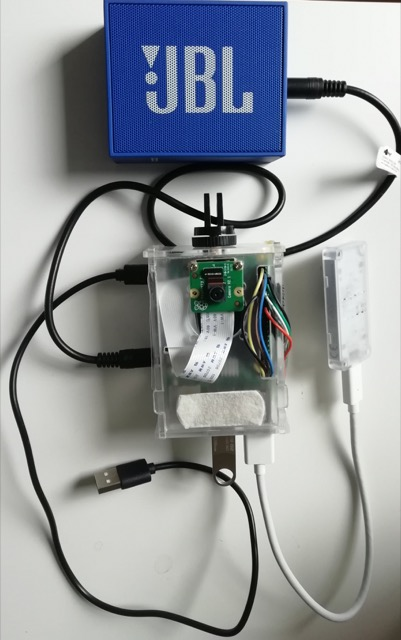

[](https://travis-ci.com/xeonqq/co-pilot)

<h2 align="center">Co-Pilot</h2>

Traffic light alert and Dashcam all in one.

`Co-Pilot` = Raspberrypi 3/4 + rpi camera + Google Coral TPU. Language support English/中文.

 <a class="bmc-button" target="_blank" href="https://www.buymeacoffee.com/xeonqq"><span style="margin-left:5px;font-size:19px !important;">Buy me a coffee 😇</span></a>
 

## Watch the demo in car
[](https://youtu.be/tCmUoWLdjoo)

## Hardware Setup


optional: [RTC DS3231](https://www.ebay.de/itm/223727782675?ssPageName=STRK%3AMEBIDX%3AIT&_trksid=p2060353.m2749.l2649), to have correct date on the dashcam video and log.

## Limitations
* Currently works only with vertically placed traffic lights, optimized for Germany.
* Delay of ~0.3 sec for each detection (Rpi 4 might have better performance, didn't have one to test)

## Dependencies
```bash on rpi
echo "deb https://packages.cloud.google.com/apt coral-edgetpu-stable main" | tee /etc/apt/sources.list.d/coral-edgetpu.list
curl https://packages.cloud.google.com/apt/doc/apt-key.gpg | apt-key add -
apt-get update
apt-get install -y libedgetpu1-std
apt-get install -y python3-pycoral
apt-get install -y python3-tflite-runtime
python3 -m pip install -r requirements_pi.txt
sudo apt-get install libsdl2-mixer-2.0-0  libsdl2-2.0-0

# instal ffmpeg
cd ~ && git clone --depth 1 https://code.videolan.org/videolan/x264
cd x264
./configure --host=arm-unknown-linux-gnueabi --enable-static --disable-opencl
make -j4 && sudo make install
cd ~ && git clone git://source.ffmpeg.org/ffmpeg --depth=1
./configure --extra-ldflags="-latomic" --arch=armel --target-os=linux --enable-gpl --enable-omx --enable-omx-rpi --enable-nonfree
make -j4 && sudo make install
```
## Run Co-Pilot
```bash
python3 -m src.main  --ssd_model models/ssd_mobilenet_v2_coco_quant_no_nms_edgetpu.tflite  --label models/coco_labels.txt --score_threshold 0.3 --traffic_light_classification_model models/traffic_light_edgetpu.tflite  --traffic_light_label models/traffic_light_labels.txt --blackbox_path=./
```
I use [superviser](http://supervisord.org/) to start co-pilot at RPI boot up.

## Adjust volume
Once you've SSH'd into your Pi, type "alsamixer". This will bring up an interface within the terminal which will allow you to set the volume of the Raspberry Pi. Simply press the up and down arrow keys to either increase or decrease the volume. When you are done, press ESC.

## Test
```bash
# under repo root foler
python3 -m pytest
# or
python3 -m tests.test_detection
python3 -m tests.test_classification
```

## Reprocess with recorded video (On Host PC)

Build and run docker container
```bash
./build.sh
./linux_run.sh
```

In docker container
```bash
cd workspace
python3 -m src.reprocess  --ssd_model models/ssd_mobilenet_v2_coco_quant_no_nms_edgetpu.tflite  --label models/coco_labels.txt --score_threshold 0.3 --traffic_light_classification_model models/traffic_light_edgetpu.tflite  --traffic_light_label models/traffic_light_labels.txt --blackbox_path=./ --video recording_20210417-090028.h264.mp4 --fps 5
```

Both main and reprocess can be run without Coral TPU by specifying --cpu option.

## References
* SSD model is downloaded from https://github.com/google-coral/test_data/blob/master/ssd_mobilenet_v2_coco_quant_postprocess_edgetpu.tflite


